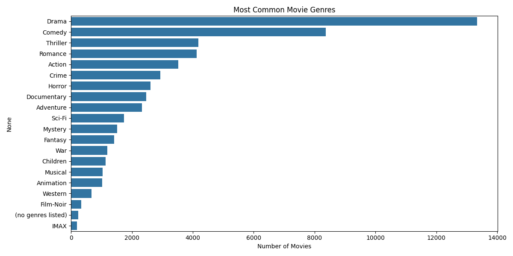
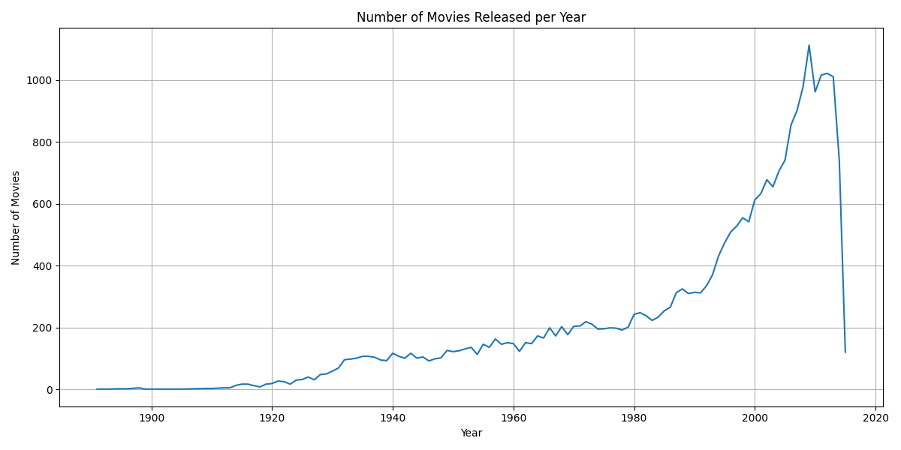
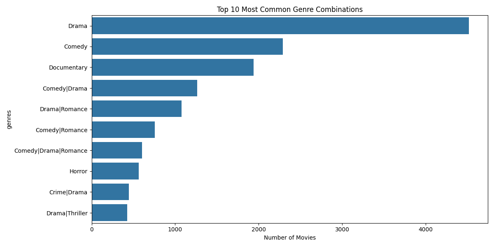

# Movie Dataset Analysis

This repository contains an analysis of a movie dataset, exploring various aspects such as genre distribution, release patterns, and genre combinations.

## Dataset Overview
- **Total number of movies:** 27256
- **Number of unique genres:** 20
- **Year range:** 1891 - 2015
- **Average movies per year:** 230

## Visualizations

### Genre Distribution

This visualization shows the distribution of movie genres in the dataset. Drama, Comedy, and Action are among the most common genres.

### Movies Released per Year

This graph displays the number of movies released each year, showing trends in movie production over time.

### Most Common Genre Combinations

This chart shows the most frequent combinations of genres in movies, highlighting popular movie categories.

## Analysis Insights
1. The dataset spans over 100 years of movie releases
2. There's a diverse range of genres and genre combinations
3. Certain genres dominate the movie industry
4. Movie production has shown significant variation over the years

## Tools Used
- Python
- Pandas
- Matplotlib
- Seaborn

## How to Use
1. Clone this repository
2. Install required dependencies
3. Run the analysis scripts
4. View the generated visualizations in the 'images' folder
